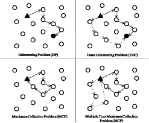

# Team Orienteering Problem (TOP) Project

## Overview

The Team Orienteering Problem (TOP) is a combinatorial optimization problem that involves planning routes for a team of agents to maximize the total score collected from various locations while adhering to constraints such as time limits. The problem is characterized by its need to balance the selection of locations with the associated travel costs, making it relevant in fields such as logistics, transportation, and urban planning.


)  

## Implementation

In this project, we developed a Python implementation of the Clark and Wright algorithm, enhanced with 2-opt and or-opt optimizations to improve the efficiency of the routing solutions. 

### Key Features

- **Clark and Wright Algorithm**: Utilizes a savings-based approach to generate initial routes for agents.
- **2-opt and Or-opt Optimizations**: These techniques refine the initial routes by reducing travel distances and improving overall efficiency.
- **Test Instances**: Problem instances used for testing the implementation are contained in the `TestInstances` folder.
- **Results**: The results for each instance are generated by the code in CSV format for easy analysis.

## Installation

To set up the project, clone the repository and install any necessary dependencies:

```bash
git clone <repository-url>
cd <repository-directory>
pip install -r requirements.txt
```

## Usage

After setting up the environment, run the main script to execute the algorithm and generate results:

```bash
python main.py
```

